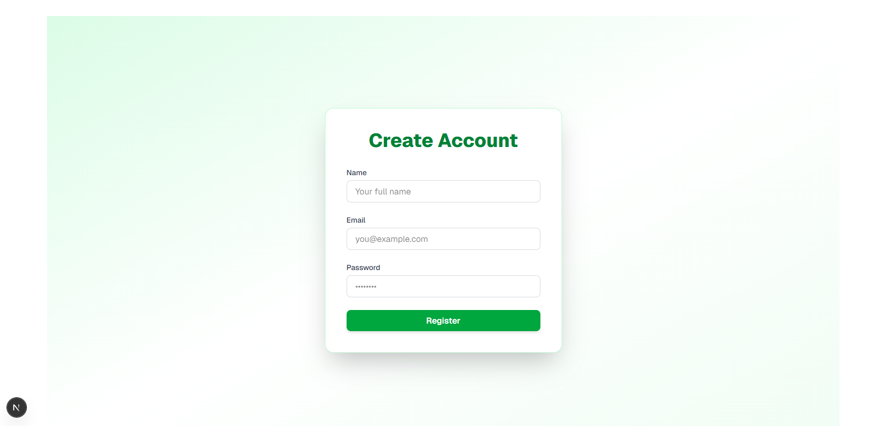
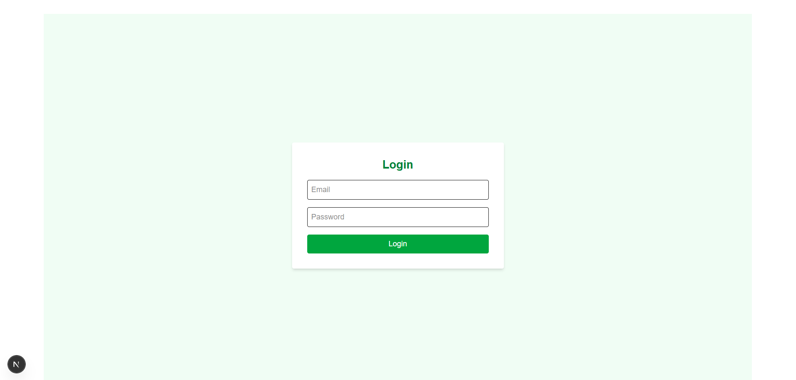
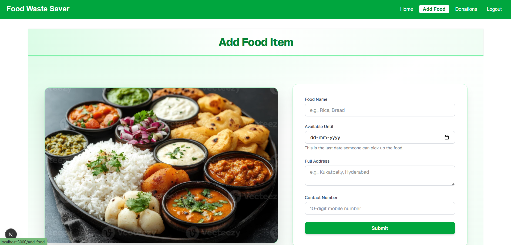
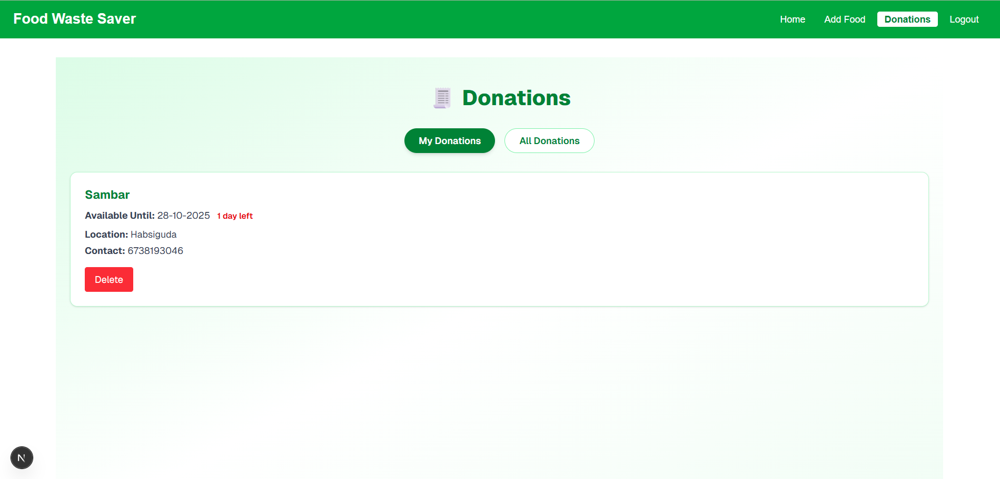
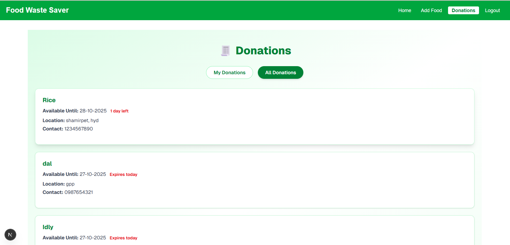
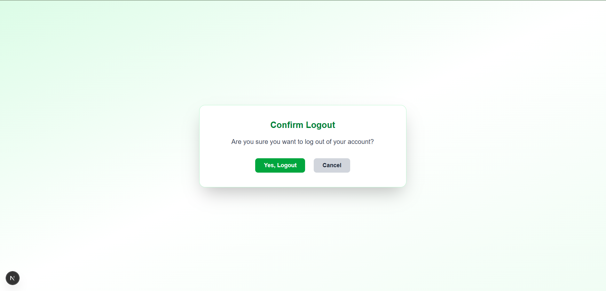

# Food Waste Saver 🍱

A responsive food donation platform built using unfamiliar technologies (Next.js, Tailwind CSS) to prove rapid learning, problem-solving, and impact-driven development. Designed to reduce food waste by connecting donors with recipients before food expires.

---

## 🚀 Features

- ✅ Client-side authentication using localStorage
- ✅ Protected routes and login flow
- ✅ Smart form validation for food donations
- ✅ Responsive UI with gradient themes and confirmation modals
- ✅ Logout confirmation modal for clean UX

---

## 🛠️ Tech Stack

- **Frontend**: Next.js (App Router), React, TypeScript
- **Styling**: Tailwind CSS
- **State & Auth**: LocalStorage
- **Design**: Gradient UI, accessible forms, responsive layout

---

## 🎯 Purpose

Built independently using AI tools and documentation to showcase adaptability and initiative. This project demonstrates my ability to learn unfamiliar technologies and deliver a fully functional, recruiter-polished product.

---

## 📸 Screenshots

### Register Page  


### Login Page  


### Home Page  


### Add Food Form  


### Donations List  
  


### Logout Confirmation Modal  



---

## 📦 Getting Started

To run the project locally:

```bash
# Install dependencies
npm install

# Start the development server
npm run dev


---

## 👩‍💻 Author

**Sai Keerthana Adi**  
📧 adisaikeerthana@gmail.com  
🔗 [LinkedIn](https://www.linkedin.com/in/adi-sai-keerthana-022145244)  
🔗 [GitHub](https://github.com/SaiKeerthana733)
